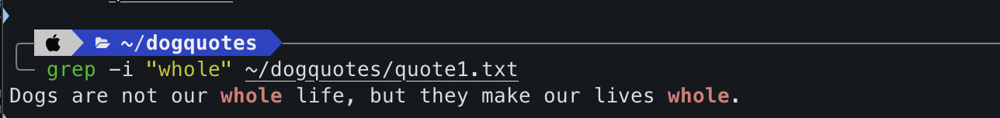
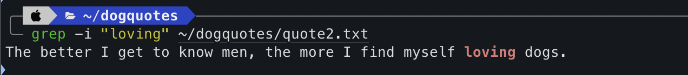
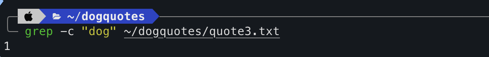
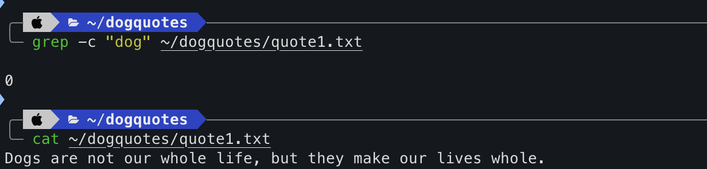
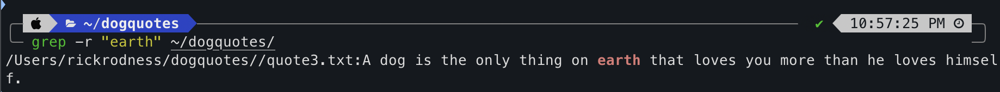
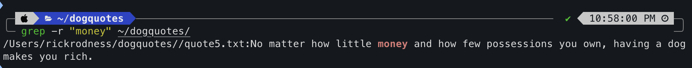
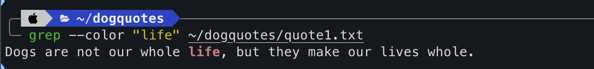
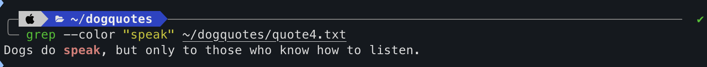

# Lab Report 3: Bugs and Commands

## Part 1 - Bugs

### Bug in `reverseInPlace` from Lab 4 

#### Failure-Inducing Input

```java
@Test
public void testReverseInPlaceFailure() {
  int[] original = {1, 2, 3, 4, 5};
  ArrayExamples.reverseInPlace(original);
  assertArrayEquals(new int[]{5, 4, 3, 2, 1}, original); // This will fail 
}
```
### Non-Failure-Inducing Input
```java
@Test
public void testReverseInPlaceSuccess() {
  int[] original = {1, 2, 3, 4, 5};
  ArrayExamples.reverseInPlace(original);
  assertArrayEquals(new int[]{1, 2, 3, 4, 5}, original); // Incorrect test that passes
}

```
**Tests**


### Symptom of `reverseInPlace` Bug

When the `testReverseInPlaceFailure` test case is run, we expect it to reverse the array in place, but due to the bug, the original array does not properly update. This is because the loop in the method incorrectly assigns the elements, resulting in each element being swapped twice and ending up in its original position.

The symptom of the bug generates a failed assertion in the test case, indicating that the expected output (a reversed array) does not match the actual output (the original array).


### Symptom of `reversed` Method Bug

The `reversed` method is supposed to return a new array with the elements of the original array in reverse order. But, due to the bug, the returned array contains all zeros. This happens because the elements of the `newArray` are never actually assigned from `arr`. Instead, the method tries to modify the original `arr` which is not correct and does not change `newArray`.

The symptom is observed as a failing test case where the expected reversed array does not match the actual returned array, which consists of all zeros.

**Before Code Change:**
```java
for(int i = 0; i < arr.length; i += 1) {
  arr[i] = newArray[arr.length - i - 1];
}
```
- In the original reversed method, the assignment was incorrectly updating the input array arr instead of the new array newArray. This leeds to the unexpected change of arr and the newArray not updating.
  
**After Code Change:**  

```java
for(int i = 0; i < arr.length; i += 1) {
  newArray[i] = arr[arr.length - i - 1];
}
```
- In the corrected version we correctly populate newArray with elements from arr in reverse order and return the new reversed array.

  
# Part 2 - Researching Commands

## grep Command Usage

### Option -i (Ignore case)

**Example 1:**

  


**Explanation:** Searches for the string "whole" in `quote1.txt` ignoring case sensitivity 
- Useful for finding matches regardless of how the text is capitalized

**Example 2:**

  


**Explanation:** Look for the word "loving" in `quote2.txt` 
- Useful when you're unsure of the text's capitalization

### Option -c (Count)

**Example 1:**

  


**Explanation:** Counts the number of times "dog" appears in `quote3.txt` 
- Useful to quantify the number of occurrences of the word

**Example 2:**

  


**Explanation:** Gives the count of the word "dog" in `quote1.txt` 

### Option -r (Recursive)

**Example 1:**

  


**Explanation:** Recursively searches for "earth" in all files within the `./quotes` directory 
- Allows for searching through multiple files at once 

**Example 2:**

  


**Explanation:** Searches for the phrase "money" throughout all files in the `./quotes` directory
- Useful for finding phrases in a large collection of documents

### Option --color (Color match)

**Example 1:**

  


**Explanation:** Highlights the term "life" in the output from `dog_happiness.txt` 
- Allows for highlighting specific words making it easier to spot

**Example 2:**

  


**Explanation:** Highlights "playful" in `puppy_playtime.txt` making it easier to find 


### Works Cited: 

[FreeCodeCamp Grep](https://www.freecodecamp.org/news/grep-command-in-linux-usage-options-and-syntax-examples/)


