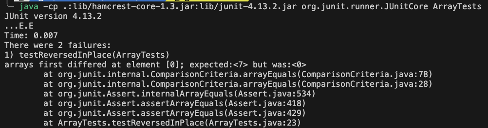
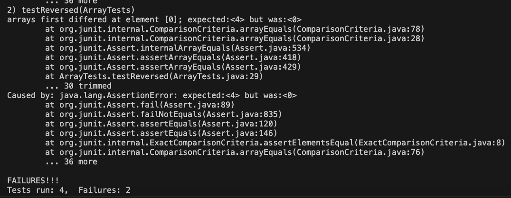

# Lab Report 3: Bugs and Commands

## Part 1 - Bugs

### Bug in `reverseInPlace` from Lab 4 

#### Failure-Inducing Input

```java
@Test
public void testReverseInPlaceFailure() {
  int[] original = {1, 2, 3, 4, 5};
  ArrayExamples.reverseInPlace(original);
  assertArrayEquals(new int[]{5, 4, 3, 2, 1}, original); // This will fail 
}
```
### Non-Failure-Inducing Input
```java
@Test
public void testReverseInPlaceSuccess() {
  int[] original = {1, 2, 3, 4, 5};
  ArrayExamples.reverseInPlace(original);
  assertArrayEquals(new int[]{1, 2, 3, 4, 5}, original); // Incorrect test that passes
}

```
**Tests**



### Symptom of `reverseInPlace` Bug

When the `testReverseInPlaceFailure` test case is run, it is expected to reverse the array in place, but due to the bug, the original array remains unchanged after the method call. This is because the loop in the method incorrectly assigns the elements, resulting in each element being swapped twice and ending up in its original position.

The symptom of the bug manifests as a failed assertion in the JUnit test case, indicating that the expected output (a reversed array) does not match the actual output (the original, unchanged array).

### Symptom of `reversed` Method Bug

The `reversed` method is supposed to return a new array with the elements of the original array in reverse order. However, due to the bug, the returned array contains all zeros. This happens because the elements of the `newArray` are never actually assigned from `arr`. Instead, the method erroneously attempts to modify the original `arr` which is not only incorrect but also does not change `newArray`.

The symptom is observed as a failing test case where the expected reversed array does not match the actual returned array, which consists of all zeros.





**Before**
```java
for(int i = 0; i < arr.length; i += 1) {
  arr[i] = newArray[arr.length - i - 1];
}
```
**After**  

```java
for(int i = 0; i < arr.length; i += 1) {
  newArray[i] = arr[arr.length - i - 1];
}
