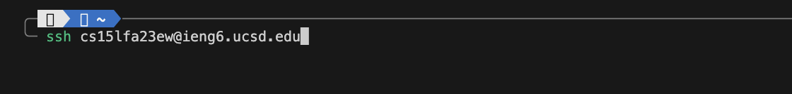
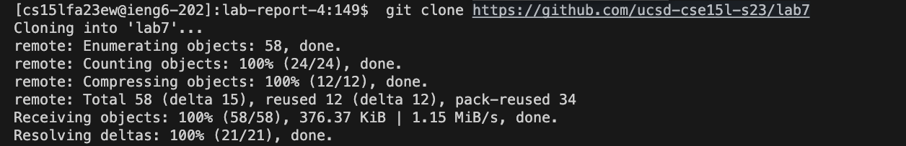
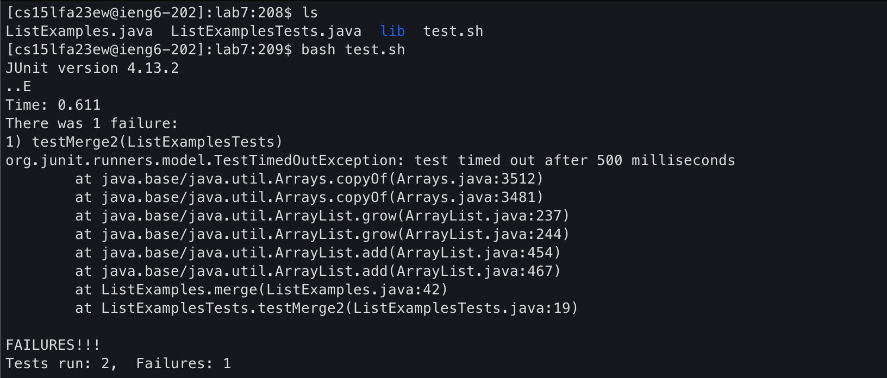
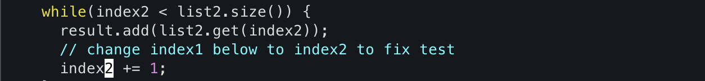
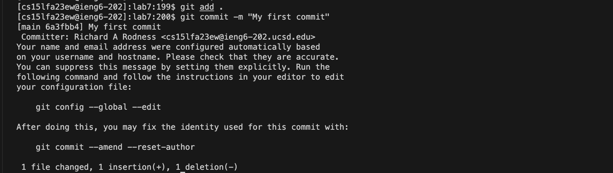

# Lab Report 4 - Vim 

## Lab Steps (4-9)
### Step 4: Log into ieng6
- **Action**: Use SSH to log into your ieng6 account.
- **Keys pressed**: `ssh cs` `<right>` `<enter>`

- **Effect**: Log into my course-specific ieng6 server using SSH, auto populate the last portion with the arrow key. 

### Step 5: Clone Your Fork from GitHub
- **Action**: Clone lab7 repository from github
- **Keys pressed**: `git clone https://github.com/ucsd-cse15l-s23/lab7`  `<enter>`

- **Effect**: Clones the repository from GitHub to ieng6 machine

### Step 6: Run the Tests (Demonstrating Failure)
- **Action**: Run the initial tests that are expected to fail 
- **Keys pressed**: `cd lab7` `<enter>` `ls` `test.sh` `<enter>`

- **Effect**: Executes the test commands, showing that the initial tests fail. 

### Step 7: Edit the Code to Fix the Failing Test
- **Action**: Edit the code file where the tests fail
- **Keys pressed**: 
    - `vim ListExamples.java` `<enter>` - Opens up ListedExamples.java in Vim to edit 
    - `:44 <enter>`  - Move cursor to line 44 
    - `fi` - Find next word on the line that starts with i 
    - `cwindex2`: - Change word where the cursor is to index2
    - `esc` + `q!` `<enter>` : Exit and save
 
- **Effect**: Opens the file in Vim for editing, makes necessary changes, and saves them. 

### Step 8: Run the Tests (Demonstrating Success)
- **Action**: Rerun the tests to show they now succeed.
- **Keys pressed**: ` bash test.sh` `<enter>`

- **Effect**: Reruns the tests, which should now pass. Use the same command as in Step 6.

### Step 9: Commit and Push the Changes
- **Action**: Commit and push the changes to your GitHub repository.
- **Keys pressed**: 
    - `git add .` `<enter>`  
    - `git commit -m "First Commit"` `<enter>`
    - `git push` `<enter>`
 
- **Effect**: Save all changes, commits them with a message, and pushes the commit to GitHub repository.

