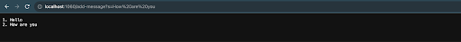
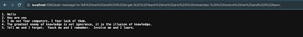
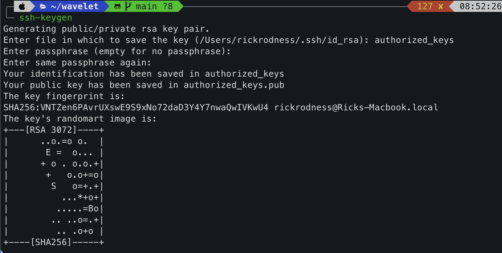
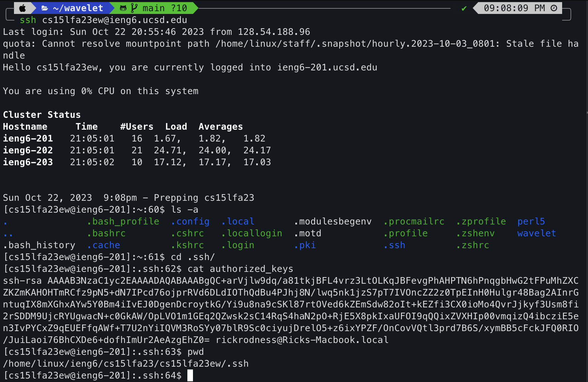
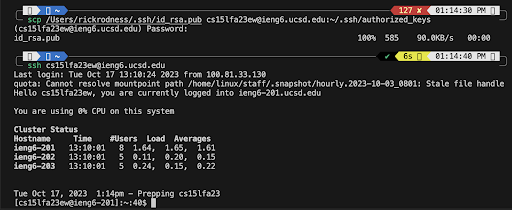

# Lab Report 2: Servers and SSH Keys

### StringServer Code:
This program consists of two primary classes: `StringHandler` and `StringServer`.

## StringHandler

- `StringHandler` is an implementation of the `URLHandler` interface
- Its primary function is to handle URI requests with the path "/add-message"
- Then build a message string using the query parameter

```java
class StringHandler implements URLHandler {
    // StringBuilder builds and stores messages
    private StringBuilder messageBuilder = new StringBuilder();
    
    // counter to keep track of the number of messages added
    private int messageCounter = 0;

    public String handleRequest(URI url) {
        // Check if the path is "/add-message"
        if (url.getPath().equals("/add-message")) {
            // Extract the query from the URI
            String query = url.getQuery();
            
            // Check if the query starts with "s="
            if (query != null && query.startsWith("s=")) {
                // Extract the message after "s=" from the query
                String message = query.substring(2);
                
                messageCounter++;
                
                // Append the message to the builder with its order number
                messageBuilder.append(messageCounter).append(". ").append(message).append("\n");
                
                return messageBuilder.toString();
            }
        }
        // Return a 404 error message if the path doesn't match or the query is invalid
        return "404 Not Found!";
    }
}
```

## StringServer
- `StringServer` is the main entry point of the application. It takes a port number as an argument and then starts the server on the provided port using the StringHandler to process requests. 

```java
class StringServer {
    public static void main(String[] args) throws IOException {
        // Check if a port number is provided
        if (args.length == 0) {
            System.out.println("Missing port number! Try any number between 1024 to 49151");
            return;
        }

        // Parse the port number from the arguments
        int port = Integer.parseInt(args[0]);

        // Start the server on the specified port with a new `StringHandler` instance
        Server.start(port, new StringHandler());
    }
}
```

  

- Which methods in your code are called? 
    - The methods called during this execution was the `handleRequest` method in the `StringHandler` class when called.
- What are the relevant arguments to those methods, and the values of any relevant fields of the class?
    - `url` argument being type URI which represents the URL of the http request.
    - `messageBuilder` uses `stringBuilder` to build response message.
    - `messageCounter` is incremented to keep track of the number of messages.
 -  How do the values of any relevant fields of the class change from this specific request? If no values got changed, explain why.
    - The value of `messageCounter` increments each time to keep track of the number of messages added.
    - `messageBuilder` appends a new number and message to the list of messages.
  
   
  
  

- Which methods in your code are called? 
    - The methods called during this execution was the `handleRequest` method in the `StringHandler` class when called.
- What are the relevant arguments to those methods, and the values of any relevant fields of the class?
    - `url` argument being type URI which represents the URL of the http request.
    - `messageBuilder` uses `stringBuilder` to build response message.
    - `messageCounter` is incremented to keep track of the number of messages.
 -  How do the values of any relevant fields of the class change from this specific request? If no values got changed, explain why.
    - The value of `messageCounter` increments each time to keep track of the number of messages added.
    - `messageBuilder` appends a new number and message to the list of messages so tthe list of numbers and strings change.
  
## Part 2 

- Using the command line, show with `ls` and take screenshots of:
    - The path to the private key for your SSH key for logging into ieng6 (on your computer or on the home directory of the lab computer)
 
    - `/Users/rickrodness/.ssh/id_rsa`
    

- The path to the public key for your SSH key for logging into ieng6 (within your account on ieng6)
    
    - `/home/linux/ieng6/cs15lfa23/cs15lfa23ew/.ssh`
  
- A terminal interaction where you log into ieng6 with your course-specific account without being asked for a password.
 

  
 

## Part 3 

- In a couple of sentences, describe something you learned from lab in week 2 or 3 that you didn’t know before.
    -  During the course of this lab I gained a lot of valuable knowledge in many key areas of web servers, ssh key setup, java server programming, and URI handling. I also learned about the HTTP protocol, which is the foundation of communication between web clients and servers which I found to be very interesting and never knew before. Also, I would consider valuable is the practical skills I honed with command line commands in Linux and learning to navigate the filesystem. One reason I learned that we need to know how to navigate the filesystem is because we will not always have a display to look at, sometimes we will be accessing servers and collections of remote access computers where there is no display. 
