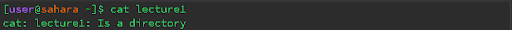
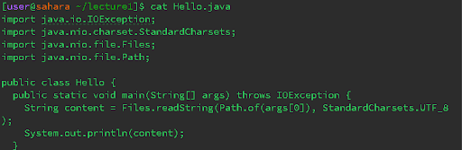

# Lab Report 1: Remote Access and Filesystem

## Introduction
This lab report documents the results of different Linux commands and navigating the filesystem.  
  
  The following documents my observations and explanations for each command's output.

## Section 1: Working Directory - `/home`
 
### Command 1: `ls`  
- **Output:** `lecture1`

- **Description:** The `ls` command lists all files in the current directory. In this case, the current directory is `/home`, so it displayed `lecture1`. No errors occurred, as this is the expected output since `lecture1` is the only visible item in the working directory.
### Command 2: `cd`
- **Output:** None
- **Description:** The `cd` command changes the directory. Since we are already in the root directory named `/home`, executing `cd` does not produce any output, and no errors occurred.

### Command 3: `cat`

- **Output:** The terminal seemed to echo back user inputs, as `cat` reads from the keyboard.
- **Description:** Running `cat` without any arguments does not display anything because it requires a file to read from. No errors occurred. 
## Section 2: Working Directory - `/home/lecture1`

### Command 1: `ls`

- **Output:** `Hello.class Hello.java messages README`
- **Description:** The `ls` command lists all files inside the directory `lecture1`. It returned `Hello.class Hello.java messages README` as the output because those are the files inside `lecture1`. No errors occurred.

### Command 2: `cd`

- **Output:** None
- **Description:** Executing `cd` moved the working directory inside `lecture1` and did so with no errors.

### Command 3: `cat`

- **Output:** Error message
- **Description:** Running `cat` with `lecture1` as an argument prompted an error message because `lecture1` is a directory, not a file that can be read or written to. 

## Section 3: Working Directory - `/lecture1`

### Command 1: `ls`

- **Output:** List of files with the name `Hello.java`
- **Description:** The `ls` command listed all files with the name `Hello.java`. No errors occurred.

### Command 2: `cd`

- **Output:** Error message
- **Description:** Executing `cd` with a file as an argument threw an error because the file is not a directory. An error occurred as `cd` is meant for changing directories, not for files.

### Command 3: `cat`

- **Output:** Contents of the file displayed
- **Description:** Running `cat` with a file as the argument displayed the contents of the file on the command line with no errors.

## Conclusion
This lab report provides insights into the behavior of various commands when used in different working directories. I found it helpful in illustrating the filesystem and learning how to use different commands in a Linux environment.

   
