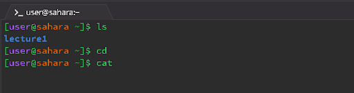
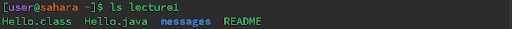
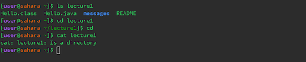
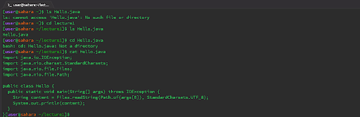

# Lab Report 1
## Remote Access and Filesystem

1. The working directory was `/home` when running the following commands: 
   - `ls` returned `lecture1` because the `ls` command lists all the files in the current directory. In this case, the directory was `/home` so it listed the only directory inside of home which was `lecture1`. Lastly, no error occurred since the output is what I would expect since `lecture1` is the only visible item inside of the current working directory.
  

 
   - `cd` returned nothing because we are already inside the root directory named `home`. No error occured.
   
   - `cat` with zero arguements did not produce any output because it did not have a file to read or write to. No error occured. 
     

2. The working directory was `/home` when running the following commands:
 
   - `ls` returned `Hello.class Hello.java messages` because the `ls` command lists all the files inside of the directory `lecture1`. No error occured. 
 
   - `cd` moved the working directory inside of `lecture1`. No error ocurred. 
     

   - `cat` without any arguments does not display anything because it requires a file to read from. No error occured. It seemed to respond back whatever I typed after back to the terminal. This is because `cat` is reading from the keyboard and echoing my inputs to the screen. 
     

3. The working directory was `/lecture1` when running the following commands: 
 
   - `ls` returned a list of all the files with the name `Hello.java`. No error occured. 
   - `cd` command with a file as an argument threw an error because the file is not a directory. An error occured becaise the file is not a directory we can move to, cd is for changing to a different directory. 
   - `cat` with a file as the argument returned the contents of the file right on the command line. No error occured. 

   
